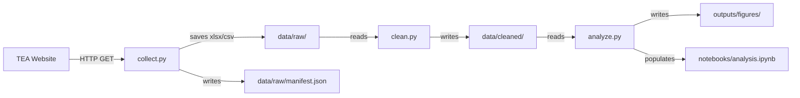

# Design Document

## Overview

This pipeline downloads, cleans, integrates, and analyzes Texas K–12 education data from the Texas Education Agency (TEA). It is three sequential Python scripts — `collect.py`, `clean.py`, `analyze.py` — plus an annotated Jupyter notebook. Each script is a flat, top-to-bottom program. No classes, no helper functions — just pandas and matplotlib calls in order.

The two primary datasets are:
- **Annual Leavers 2023-24** — district-level Excel file tracking students who left school
- **Enrollment Trends 2023-24** — statewide enrollment data by year and district

The final deliverable is `notebooks/analysis.ipynb` with cleaned data, visualizations, and at least three written insights referencing specific districts or ESC regions.

---

## Architecture

The pipeline follows a linear ETL pattern. Each script reads from the previous stage's output directory. No shared state except files on disk.



Run in order:

```
python scripts/collect.py
python scripts/clean.py
python scripts/analyze.py
```

Then open `notebooks/analysis.ipynb`.

---

## Components and Interfaces

### `scripts/collect.py`

A flat script that runs top to bottom. What it does, in order:

1. Create `data/raw/` if it doesn't exist
2. For each TEA dataset URL, send an HTTP GET request
3. If the response is not 200, print an error with the URL and status code and stop
4. Save the downloaded file to `data/raw/` with a stable filename
5. Build a list of metadata dicts (url, format, timestamp, local path)
6. Write that list to `data/raw/manifest.json`

No functions. Just `import requests`, `import json`, `os.makedirs(...)`, `open(...)`, done.

Manifest entry shape:
```json
{
  "dataset": "leavers_2023_24",
  "source_url": "https://tea.texas.gov/...",
  "file_format": "xlsx",
  "local_path": "data/raw/leavers_2023_24.xlsx",
  "collected_at": "2024-01-15T10:30:00Z"
}
```

---

### `scripts/clean.py`

A flat script that runs top to bottom. What it does, in order:

1. Read `data/raw/leavers_2023_24.xlsx` into a DataFrame with `pd.read_excel(..., engine="openpyxl")`
2. Read `data/raw/enrollment_2023_24.xlsx` (or `.csv`) into a second DataFrame
3. For each DataFrame:
   - Lowercase column names, replace spaces with underscores: `df.columns = df.columns.str.lower().str.replace(" ", "_")`
   - Fill numeric NaN with 0, string NaN with "Unknown", print counts
   - Drop duplicate rows, print count removed
   - Zero-pad the district ID column to 6 digits: `df["district_id"] = df["district_id"].astype(str).str.zfill(6)`
4. Outer-join the two DataFrames on `district_id`, fill unmatched fields with 0
5. Print unmatched district IDs from each side
6. Save three CSVs to `data/cleaned/`
7. Print a summary: row count, column count, missing value counts for each output

Output files:
- `data/cleaned/leavers_2023_24.csv`
- `data/cleaned/enrollment_2023_24.csv`
- `data/cleaned/merged_district_2023_24.csv`

---

### `scripts/analyze.py`

A flat script that runs top to bottom. What it does, in order:

1. Create `outputs/figures/` if it doesn't exist
2. Load `data/cleaned/merged_district_2023_24.csv` and `data/cleaned/enrollment_2023_24.csv`
3. Compute statewide enrollment per year: `df.groupby("school_year")["enrollment_count"].sum()`
4. Plot and save `enrollment_trend.png`
5. Compute statewide leaver count per year the same way, plot and save `leaver_trend.png`
6. Add a `leaver_rate` column: `df["leaver_rate"] = df["leaver_count"] / df["enrollment_count"].replace(0, float("nan"))` then `.fillna(0)`
7. Group by `esc_region`, compute mean leaver rate, plot and save `leaver_rate_by_esc_region.png`
8. Sort by `leaver_rate`, take top 10 rows, plot and save `top10_leaver_districts.png`
9. For each demographic column (race/ethnicity, gender, eco_dis), compute leaver counts and rates, plot and save `leaver_rate_by_demographic.png`
10. Print 3+ insight summaries with specific district names and numeric values

All `plt.savefig(...)` calls use relative paths. Every chart gets a title and axis labels before saving.

Figures produced:
| Filename | Chart type | Data |
|---|---|---|
| `enrollment_trend.png` | Line | Statewide enrollment by year |
| `leaver_trend.png` | Line | Statewide leaver count by year |
| `leaver_rate_by_esc_region.png` | Bar | Mean leaver rate per ESC region |
| `top10_leaver_districts.png` | Bar | Top 10 districts by leaver rate |
| `leaver_rate_by_demographic.png` | Bar | Leaver rate by demographic group |

---

### `notebooks/analysis.ipynb`

Structure:
1. Markdown: title, dataset sources, URLs, collection method
2. Markdown: **Data Collection** — describes the download step
3. Markdown: **Data Cleaning** — describes cleaning steps
4. Code: load cleaned CSVs, display shape and head
5. Markdown: **Trend Analysis**
6. Code: enrollment and leaver trend charts
7. Markdown: **Regional & District Variation**
8. Code: ESC region bar chart, top-10 districts chart
9. Markdown: **Demographic Analysis**
10. Code: demographic breakdown chart
11. Markdown: **Key Insights** — 3+ written insights with specific names and numeric values

Every code cell has at least one `#` comment per logical step.

---

## Data Models

### Raw Leaver Dataset (Excel, as-downloaded)

| Raw column (approximate) | Cleaned column | Type |
|---|---|---|
| District Number | district_id | str (6-digit zero-padded) |
| District Name | district_name | str |
| ESC Region | esc_region | int |
| Total Leavers | leaver_count | int |
| Dropout Count | dropout_count | int |
| Completer Count | completer_count | int |
| Race/Ethnicity columns | race_* | int |
| Eco Dis | eco_dis_count | int |
| Gender columns | gender_* | int |
| Year | school_year | str |

### Raw Enrollment Dataset

| Raw column (approximate) | Cleaned column | Type |
|---|---|---|
| District Number | district_id | str (6-digit zero-padded) |
| District Name | district_name | str |
| ESC Region | esc_region | int |
| Year | school_year | str |
| Total Enrollment | enrollment_count | int |

### Merged Dataset (`merged_district_2023_24.csv`)

Union of both cleaned datasets joined on `district_id`. Additional derived column:

| Column | Type | Description |
|---|---|---|
| leaver_rate | float | `leaver_count / enrollment_count` (0.0 where enrollment = 0) |

### Manifest (`data/raw/manifest.json`)

```json
[
  {
    "dataset": "leavers_2023_24",
    "source_url": "https://tea.texas.gov/...",
    "file_format": "xlsx",
    "local_path": "data/raw/leavers_2023_24.xlsx",
    "collected_at": "2024-01-15T10:30:00Z"
  }
]
```

---

## Correctness Properties

*A property is a characteristic or behavior that should hold true across all valid executions of a system — essentially, a formal statement about what the system should do. Properties serve as the bridge between human-readable specifications and machine-verifiable correctness guarantees.*

### Property 1: Downloaded files are saved under data/raw/ with a relative path

*For any* successful file download, the saved path must begin with `data/raw/` and must not be an absolute path (no leading `/` or drive letter like `C:\`).

**Validates: Requirements 1.3, 10.1**

---

### Property 2: Download failure log contains URL and status code

*For any* HTTP response with a non-200 status code, the error output must contain both the requested URL and the numeric HTTP status code.

**Validates: Requirements 1.4**

---

### Property 3: Manifest contains required fields for every dataset

*For any* set of downloaded datasets, `data/raw/manifest.json` must contain one entry per dataset, and each entry must include `source_url`, `file_format`, and `collected_at` with non-empty values.

**Validates: Requirements 1.5**

---

### Property 4: Cleaner never modifies files in data/raw/

*For any* cleaning run, the set of files in `data/raw/` and their contents must be identical before and after `clean.py` executes.

**Validates: Requirements 2.1**

---

### Property 5: All cleaner outputs are CSVs in data/cleaned/

*For any* cleaning run, every file written must reside under `data/cleaned/` and have a `.csv` extension.

**Validates: Requirements 2.2**

---

### Property 6: Cleaning is idempotent

*For any* input raw data, running `clean.py` twice must produce output files with identical contents to running it once.

**Validates: Requirements 2.3**

---

### Property 7: Column names are normalized after cleaning

*For any* DataFrame with arbitrary column names, after normalization every column name must match `[a-z][a-z0-9_]*` (lowercase, underscores only, starts with a letter).

**Validates: Requirements 3.3**

---

### Property 8: No missing values remain after filling

*For any* DataFrame with NaN values, after the fill step the DataFrame must contain zero NaN values — numeric columns filled with `0`, string columns filled with `"Unknown"`.

**Validates: Requirements 3.4, 3.5**

---

### Property 9: No duplicate rows remain after deduplication

*For any* DataFrame, after dropping duplicates the result contains no duplicate rows, and running the drop again produces the same result.

**Validates: Requirements 3.6**

---

### Property 10: District IDs are zero-padded 6-digit strings

*For any* district ID value (integer or string of any length ≤ 6), after zero-padding the value must be exactly 6 characters and match `[0-9]{6}`.

**Validates: Requirements 3.7**

---

### Property 11: Merged dataset retains all district IDs from both inputs

*For any* two DataFrames with a `district_id` column, the outer-joined result must contain every `district_id` from either input. Districts only in leavers get enrollment fields set to `0`; districts only in enrollment get leaver fields set to `0`.

**Validates: Requirements 4.1, 4.3, 4.4**

---

### Property 12: Trend aggregation returns one row per year with the correct sum

*For any* DataFrame with `school_year` and a numeric count column, grouping by year and summing must return exactly one row per unique year, with each value equal to the sum of that year's rows.

**Validates: Requirements 5.1, 5.2**

---

### Property 13: All figures have non-empty axis labels and a title

*For any* figure produced by the analyzer, the matplotlib figure must have a non-empty title and non-empty x-axis and y-axis labels before being saved.

**Validates: Requirements 5.5**

---

### Property 14: Leaver rate formula is correct and handles zero enrollment

*For any* district row where `enrollment_count > 0`, `leaver_rate` must equal `leaver_count / enrollment_count`. For any row where `enrollment_count = 0`, `leaver_rate` must be `0.0` (not NaN or infinity).

**Validates: Requirements 6.1**

---

### Property 15: Top-N districts are correctly ranked

*For any* DataFrame with a `leaver_rate` column and at least N rows, the top-N result's minimum `leaver_rate` must be greater than or equal to the maximum `leaver_rate` in the bottom-N result.

**Validates: Requirements 6.2**

---

### Property 16: Demographic breakdown covers all qualifying columns

*For any* DataFrame, the demographic breakdown must include every column with fewer than 5 distinct non-null values that is identified as a demographic column. No qualifying column may be silently omitted.

**Validates: Requirements 7.1, 7.3**

---

### Property 17: No absolute paths appear in any script or notebook

*For any* Python source file under `scripts/` or in `notebooks/analysis.ipynb`, no string literal may begin with `/` or match `[A-Za-z]:\\`.

**Validates: Requirements 10.1**

---

### Property 18: Required directories are auto-created before any file write

*For any* script in the pipeline, if `data/raw/`, `data/cleaned/`, or `outputs/figures/` does not exist at the start of execution, the script must create it before attempting to write any file there.

**Validates: Requirements 10.2**

---

## Error Handling

**collect.py** — wrap each `requests.get()` in a try/except. On any exception or non-200 status, print `ERROR: Failed to download {url} — HTTP {status_code}` and stop. Don't proceed to cleaning with fewer than 2 datasets.

**clean.py** — if `pd.read_excel()` or `pd.read_csv()` raises, print the filename and error and re-raise. If a required column like `district_id` is missing after normalization, print a warning and try a best-effort column name match before failing.

**analyze.py** — if an expected demographic column is absent, print `WARNING: column '{col}' not found — skipping` and continue with the rest. Use `df["enrollment_count"].replace(0, float("nan"))` before dividing to avoid ZeroDivisionError, then `.fillna(0)`.

**All scripts** — use `os.makedirs(path, exist_ok=True)` before any file write.

---

## Testing Strategy

Simple pytest tests. No elaborate infrastructure — just straightforward assertions against known inputs and outputs.

**Unit tests** cover:
- `requests.get` mocked to return 200 and non-200 responses — check file is saved / error is printed
- Manifest JSON has all required fields after collect runs
- Column normalization on a small hand-crafted DataFrame
- NaN filling on a DataFrame with known missing positions
- District ID zero-padding on edge cases (1-digit, 5-digit, already 6-digit)
- Outer join on two small DataFrames with known left-only, right-only, and matched rows
- Leaver rate computation with a zero-enrollment row
- File existence after each script runs end-to-end

**Property-based tests** use **Hypothesis** to verify the universal properties above. Each test runs at least 100 examples and includes a comment referencing the design property.

```python
# Feature: texas-k12-education-analysis, Property 7: Column names are normalized after cleaning
@given(st.lists(st.text(min_size=1), min_size=1))
@settings(max_examples=100)
def test_normalize_columns(column_names):
    df = pd.DataFrame(columns=column_names)
    df.columns = df.columns.str.lower().str.replace(r"[^a-z0-9]", "_", regex=True)
    assert all(re.match(r"[a-z][a-z0-9_]*", c) for c in df.columns)
```

Each correctness property maps to exactly one property-based test. Unit tests handle the concrete examples and edge cases.

Dependencies:
```
pandas
matplotlib
seaborn
openpyxl
requests
pytest
hypothesis
pytest-mock
```

Run with:
```bash
pytest tests/ --tb=short
```
